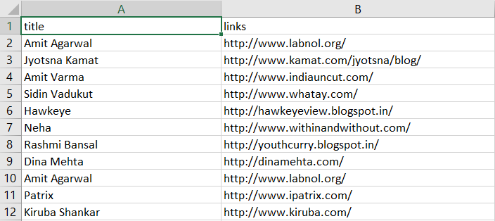

A Simple beautifulsoup-enabled python script to get the list of blog urls from (https://indianbloggers.org/) and outputing a csv with the list.

<ul>
<li>BeautifulSoup (Used for Data Extraction)</li>
<li>Pandas (Used to store the Output File)</li>
<li>Matplotlib (Blog Hosting Type Plot)</li>
</ul>

Snapshot of the visualization

Snapshot of the csv file

